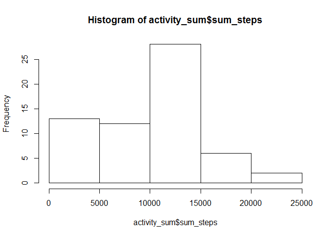
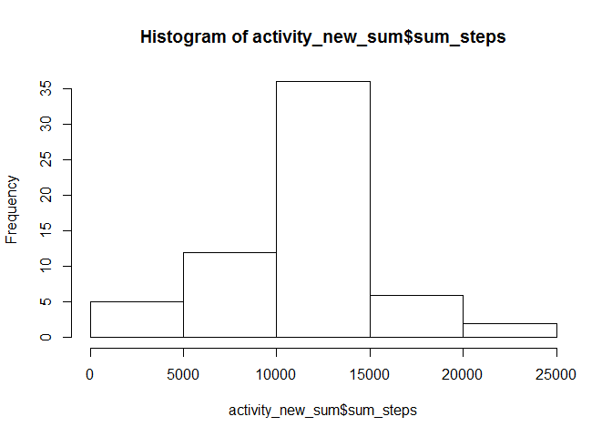
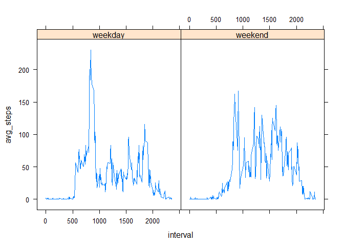

# Reproducible Research: Peer Assessment 1


## Loading and preprocessing the data

```r
suppressPackageStartupMessages(library(dplyr))
```

```
## Warning: package 'dplyr' was built under R version 3.2.2
```

```r
unzip("./activity.zip")
activity <- read.csv("./activity.csv")
activity$date <- as.Date(activity$date)
activity_g <- group_by(activity, date)
```


## What is mean total number of steps taken per day?

```r
#library(dplyr)
activity_sum <- summarise(activity_g, sum_steps = sum(steps, na.rm = TRUE))
hist(activity_sum$sum_steps)
```

 

```r
#activity_sum
mean(activity_sum$sum_steps)
```

```
## [1] 9354.23
```

```r
median(activity_sum$sum_steps)
```

```
## [1] 10395
```


## What is the average daily activity pattern?

```r
#library(dplyr)
activity_g2 <- group_by(activity, interval)
activity_mean <- summarise(activity_g2, mean_steps = mean(steps, na.rm = TRUE))
plot(activity_mean, type = "l")
```

 

```r
activity_mean[activity_mean$mean_steps == max(activity_mean$mean_steps), ]
```

```
## Source: local data frame [1 x 2]
## 
##   interval mean_steps
##      (int)      (dbl)
## 1      835   206.1698
```


## Imputing missing values

```r
x <- activity[is.na(activity$steps),]
nrow(x)
```

```
## [1] 2304
```

```r
#strategy: using the mean of the interval to fill NA values for the particular interval.
#the mean for each interval was captured in the previous section, so it was just to structure the looping through the dataset and logically determining if "steps" was NA or not

activity_new <- activity

for (i in 1:nrow(activity_new))
{
  if (is.na(activity[i, "steps"]))
  {
  activity_new[i, "steps"] = activity_mean[activity_mean$interval == activity_new[i, "interval"], "mean_steps"]
  }
}

activity_new_g <- group_by(activity_new, date)
activity_new_sum <- summarise(activity_new_g, sum_steps = sum(steps))
hist(activity_new_sum$sum_steps)
```

 

```r
mean(activity_new_sum$sum_steps)
```

```
## [1] 10766.19
```

```r
median(activity_new_sum$sum_steps)
```

```
## [1] 10766.19
```
The overal mean and median of the days for the dataset changed significantly when the NA values were replaced with the mean for it's respective interval. The median and mean are now equal to each other and the histogram for the new dataset is now more Gaussian looking.

## Are there differences in activity patterns between weekdays and weekends?

```r
library(lattice)
activity_new$wdwe <- ""
x <- weekdays(activity_new$date)

for (i in 1:length(x))
{
  if (identical(x[i], "Saturday") | identical(x[i], "Sunday")) #test if it's the weekend and records
  {
    activity_new$wdwe[i] <- "weekend"
  }
  
  else activity_new$wdwe[i] <- "weekday" #if not a weekend then a weekday

}
activity_new$wdwe <- factor(activity_new$wdwe)
activity_new_g <- group_by(activity_new, wdwe, interval)
activity_new_avg <- summarise(activity_new_g, avg_steps = mean(steps))

xyplot(avg_steps~interval|wdwe, data = activity_new_avg, type = "l")
```

 

